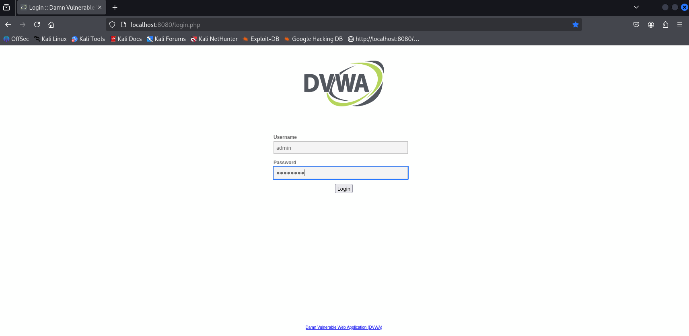
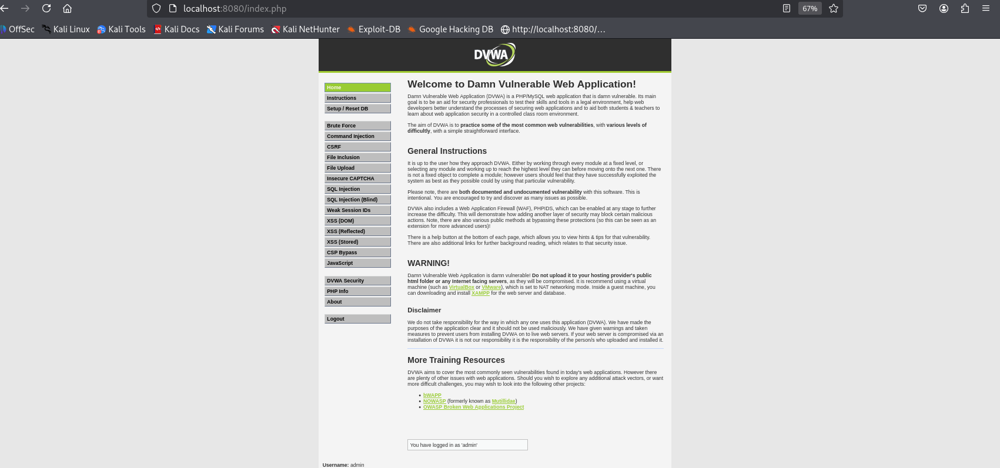

# SQL Injection usando Kali con docker DVWA
#### By Patricia Sagbay

Hoy en día existen muchísimos sitios que ofrecen cursos y capacitaciones de todo tipo. Para alguien que recién comienza en el mundo de la ciberseguridad, tanta información puede resultar abrumadora. Por eso nace este espacio como un aporte a la comunidad de habla hispana, con el objetivo de orientar, compartir conocimientos y facilitar el aprendizaje paso a paso.

## Requerimientos
Descargar la ISO de Kali Linux X86_64 que pesa 4.1GB: 
```bash
https://www.kali.org/get-kali/ 
```
Esta ISO usa el hash SHA256 para validar la integridad de tu descarga, mi hash de descarga es 5723d46414b45575aa8e199740bbfde49e5b2501715ea999f0573e94d61e39d3 

## Instalacion de Kali y docker DVWA
En el siguiente link podemos ver la instalación de Kali Linux en computadoras de escritorio y portátiles mediante archivos ".ISO" (x64/x86)
```bash
https://www-kali-org.translate.goog/docs/installation/?_x_tr_sl=en&_x_tr_tl=es&_x_tr_hl=es&_x_tr_pto=tc
```
Una vez instalado la ISO del Kali Linux, desde la terminal usamos los siguientes comandos para actualizar la lista de paqueres disponibles e instalar las versiones mas recientes de los paquetes:
```bash
sudo apt update

sudo apt upgrade
```
Como siguiente paso, vamos a instalar Docker desde la terminal de Kali Linux:
```bash
sudo apt install docker.io -y

sudo systemctl start docker

sudo systemctl enable docker
```
Ahora vamos a instalar el docker compose (Opcional pero recomendado) si vas a definir y ejecutar aplicaciones dockers con multiples contenedores.
```bash
sudo apt install docker-compose -y
```
Descarga la Imagen DVWA desde docker hub

```bash
sudo docker pull vulnerables/web-dvwa
```

Ejecuta DVWA en tu contenedor:
```bash
sudo docker run -d -p 80:80 vulnerables/web-dvwa
```
-d: ejecuta el contenedor en segundo plano.

-p 80:80: expone el puerto 80 del contenedor al puerto 80 de tu máquina.

Accede al DVWA desde tu navegador:

```bash
http://localhost
```
Credenciales por defecto
```bash
#Usuario: 
admin

#Contraseña: 
password
```

*Imagen 1*



*Imagen 2*



Una vez dentro, ve a la pestaña "Setup / Reset DB" para inicializar la base de datos.

## Configuración de DVWA

Acceda al elemento de menú “Seguridad DVWA” desde la barra lateral izquierda, cerca de la parte inferior. 

DVWA ofrece cuatro opciones para configurar el nivel de dificultad de sus pruebas de penetración: Bajo , Medio , Alto y una opción adicional llamada Imposible . Estas cuatro opciones determinan la vulnerabilidad de DVWA a sus ataques.

### Bajo: 

Esta es la configuración predeterminada para la instalación de Docker. Este nivel de seguridad es completamente vulnerable y no cuenta con ninguna medida de seguridad. Sirve como ejemplo de cómo las vulnerabilidades de las aplicaciones web se manifiestan a través de malas prácticas de programación y sirve como plataforma para enseñar o aprender técnicas básicas de explotación.

### Medio: 

Esta configuración demuestra principalmente malas prácticas de seguridad al mostrar cómo el desarrollador intentó, sin éxito, proteger una aplicación. También insta a los usuarios a perfeccionar sus técnicas de explotación.

### Alto: 

Esta opción es una extensión del nivel Medio, y los desarrolladores han implementado una combinación de malas prácticas más difíciles o alternativas para proteger el código. Las vulnerabilidades en este nivel limitan su explotación, similar a cómo se gestionan las competiciones de Capturar la Bandera (CTF).

### Imposible: 

Esta es la configuración predeterminada para la instalación de Kali Linux. Debe comparar el código fuente vulnerable con el código fuente relativamente seguro de los desarrolladores.

## Vamos a practicar con DVWA

```bash
http://localhost:8080/login.php
```
Usaremos nivel bajo (slow) y usaremos las siguientes consultas sql que permitan identificar las vulnerabilidades del sitio usando payloads:

#### Payload 1:

```bash

'
```

Es lo mismo que hacer una consulta sql:
```bash
SELECT * FROM usuarios WHERE nombre = 'juan';
```

#### Payload 2:
```bash
'1' OR 1=1#' AND password = '';
```

Es lo mismo que hacer una consulta sql:
```bash

SELECT * FROM users WHERE username = '$usuario' AND password = '$clave';

```
#### Payload 3:
```bash
1' ORDER BY 1 -- -

```

Es lo mismo que hacer una consulta sql:
```bash

SELECT * FROM users WHERE id = '1' ORDER BY 1 -- -';

```

<table>
  <tr>
   <td>Payload
   </td>
   <td>Consulta SQL (Win / Linux)
   </td>
   <td>Descripcion
   </td>
  </tr>
  <tr>
   <td> '
   </td>
   <td>SELECT * FROM users WHERE username = 'juan';
   </td>
   <td>Existe una vulnerabilidad en el código del sitio web DVWA 
   </td>
  </tr>
  <tr>
   <td>1' or 1=1#
        </td>
   <td> SELECT * FROM users WHERE id = '$input';
<p>
<td>1’:Cierra la comilla de la consulta SQL original.
  OR 1=1:Condición siempre verdadera, para forzar a devolver todas las filas.
  
#:Comentario en SQL (MySQL/MariaDB). Ignora el resto de la consulta.
   </td>
   <td> 
   </td>
  </tr>
  <tr>
   <td>1' ORDER BY 1 -- -
   </td>
   <td>SELECT * FROM users WHERE id = '1' ORDER BY 1 -- -';
   </td>
   <td>Check existing IoCs in  loaded DLL file hash 
   </td>
  </tr>
  <tr>
   <td>Sysmon event 15
   </td>
   <td>win.eventdata.hashes
   </td>
   <td>Check existing IoCs in  downloaded file hash 
   </td>
  </tr>
  <tr>
   <td>Sysmon event 22
   </td>
   <td>win.eventdata.queryName
   </td>
   <td>Check existing IoCs in  queried hostname
   </td>
  </tr>
  <tr>
   <td>Sysmon event 23
   </td>
   <td>win.eventdata.hashes
   </td>
   <td>Check existing IoCs in  deleted file hash 
   </td>
  </tr>
  <tr>
   <td>Sysmon event 24
   </td>
   <td>win.eventdata.hashes
   </td>
   <td>Check existing IoCs in  clipboard content file hash 
   </td>
  </tr>
  <tr>
   <td>Sysmon event 25
   </td>
   <td>win.eventdata.hashes
   </td>
   <td>Check existing IoCs in  process file hash 
   </td>
  </tr>
  <tr>
   <td>Wazuh Syscheck (Files)
   </td>
   <td>syscheck.sha256_after
   </td>
   <td>Check existing IoCs in  files added/modified/removed (file hash)
   </td>
  </tr>
</table>


Puedes ver el video del ejemplo en el siguiente link:

(estamos trabajando en aquello)
